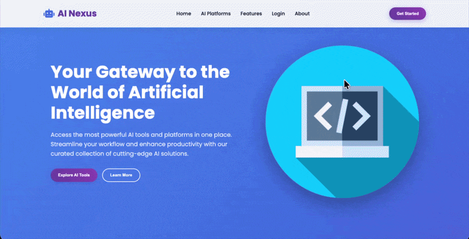

# AI Nexus

> A web-based directory for discovering and accessing AI tools from a single, curated interface.

AI Nexus was developed as a project for the **Digital School** programming course. The project combines a polished responsive frontend with a PHP/MySQL backend for user registration, authentication, session handling, and an administrative dashboard.

## Demo



## Overview

AI Nexus is designed as a central hub for discovering popular artificial intelligence platforms across categories such as conversational AI, image generation, coding assistants, video, and voice tools.

The project focuses on creating a clean product-style experience rather than presenting the directory as a simple list of links. It includes a responsive landing page, animated UI elements, dedicated authentication screens, and an admin dashboard for monitoring platform activity.

## Features

- Curated AI platform directory
- Direct links to featured AI services
- Responsive landing page
- Animated hero and section transitions
- User registration with password hashing
- PHP session-based authentication
- Remember-me authentication flow
- Admin dashboard
- Dashboard statistics and charts
- Responsive login and registration interfaces
- Reusable visual styling and component-like page sections

## Tech Stack

| Technology | Purpose |
| --- | --- |
| **HTML5** | Page structure and semantic markup |
| **CSS3** | Responsive layouts, animations, gradients, and visual styling |
| **JavaScript** | UI interactions, smooth scrolling, and reveal animations |
| **PHP** | Server-side authentication, registration, sessions, and routing |
| **MySQL / MariaDB** | User data persistence |
| **Chart.js** | Dashboard data visualization |
| **Font Awesome** | Interface icons |
| **Google Fonts** | Poppins typography |

## Application Structure

### Public Website

The main landing page introduces AI Nexus and provides access to featured AI platforms including:

- ChatGPT
- Midjourney
- GitHub Copilot
- Claude
- Runway
- ElevenLabs

The interface uses responsive layouts, animated section reveals, hover states, gradient styling, and smooth navigation to create a product-oriented experience.

### Authentication

AI Nexus includes separate registration and login interfaces.

Registration stores user credentials in the database using PHP's `password_hash()` function. Login uses PHP sessions to maintain authenticated state, while the remember-me flow generates a random token with an expiry time.

### Admin Dashboard

Authenticated administrators can access a dashboard containing:

- Visitor statistics
- User statistics
- Comment statistics
- Engagement metrics
- Site-visit visualization
- Traffic-source visualization
- Recent comments
- Dashboard navigation and logout

Charts are rendered using **Chart.js**.

## Project Structure

```text
.
├── index.html          # Main AI Nexus landing page
├── index.css           # Global styles and responsive layouts
├── index.js            # Frontend interactions and animations
├── login.htm            # Login interface
├── login.php           # Login and session handling
├── register.html        # Registration interface
├── register.php         # User registration
├── dashboard.php        # Admin dashboard
├── logout.php           # Session logout
├── db.php               # Database connection
├── ai_nexus.sql         # Database schema
└── demo.gif             # Project demonstration
```

## Database

The project uses a MySQL/MariaDB database named `ai_nexus`.

The included SQL dump defines the `users` table with:

- Auto-incrementing user IDs
- Unique email addresses
- Username storage
- Hashed passwords

Import `ai_nexus.sql` into your local MySQL/MariaDB server before running the PHP application.

## Getting Started

### Prerequisites

You will need:

- PHP 8.1+
- MySQL or MariaDB
- A local PHP development environment such as XAMPP, MAMP, or a comparable setup
- A web browser

### 1. Clone the repository

```bash
git clone https://github.com/DaveCodesWebs/Projekt-DS.git
cd Projekt-DS
```

### 2. Create the database

Create a database named `ai_nexus`, then import:

```text
ai_nexus.sql
```

### 3. Configure the database connection

Update the database credentials in `db.php` and `login.php` to match your local environment.

### 4. Start the PHP server

From the project directory:

```bash
php -S localhost:8000
```

Then open:

```text
http://localhost:8000
```

## Technical Highlights

### Password hashing

Registration uses PHP's built-in password hashing API rather than storing passwords as plain text:

```php
$password = password_hash($_POST['password'], PASSWORD_DEFAULT);
```

### Session-based authentication

Authenticated users are tracked with PHP sessions, and protected dashboard access is checked server-side before the dashboard is rendered.

### Remember-me flow

The login system generates a cryptographically random token and stores an expiry time for the remember-me functionality.

### Responsive UI

The frontend adapts its layouts for smaller screens using CSS media queries, including mobile-specific navigation, stacked sections, and responsive authentication forms.

### Progressive UI animation

The frontend uses `IntersectionObserver` to reveal elements as they enter the viewport, reducing the need to trigger every animation immediately on page load.

## Project Context

This project was created as part of the **Digital School** programming course to apply web development concepts in a complete project rather than isolated exercises.

It combines frontend design, responsive CSS, JavaScript interactions, PHP server-side logic, authentication, and relational database fundamentals into one application.

## Future Improvements

Potential next steps for turning AI Nexus into a production-ready platform include:

- Database-driven AI tool management
- Search and category filtering
- User reviews and ratings
- Real user analytics
- Admin CRUD operations for AI platforms
- Role-based authorization
- Password reset and email verification
- OAuth authentication
- API integrations for platform metadata
- Improved validation and security hardening

## Author

**David Dundo**

GitHub: [@DaveCodesWebs](https://github.com/DaveCodesWebs)
